# RabbitMQ Reliable Messaging Demo

<div align="center">

**Spring Boot + RabbitMQ 可靠消息全链路学习项目**

从消息发送、Broker 确认、路由失败、消费重试、幂等处理，到 Retry Queue、TTL、DLX、DLQ 与失败补偿，一份 README 看完项目、源码思路、测试过程和面试要点。

    

</div>

> [!IMPORTANT]
> 当前公开的 `master` 分支是一次未同步完整的代码快照：文档中使用的 `RabbitPublisherConfirmConfig`、`PublisherRetryService` 和 `PublisherMessageRecordMapper` 尚未出现在源码目录，因此当前版本会在编译阶段失败。本文保留完整设计与学习资料，运行项应在上述源码同步完成后使用。

## 项目定位

这个仓库不是只演示 `convertAndSend()` 的 Hello World，而是围绕消息可靠性回答下面这些问题：

- Producer 如何知道消息是否到达 Broker、是否成功路由到 Queue？
- Confirm 与 Return 回调乱序时，怎样避免错误覆盖最终状态？
- Consumer 失败后，怎样组合 JVM 内快速重试和 RabbitMQ 延迟重试？
- 同一业务消息重复投递时，怎样用唯一键与 `INSERT IGNORE` 原子抢占消费资格？
- 多轮失败后，怎样进入最终 DLQ，并由消费者手动 ACK？
- 为什么当前方案只能准确描述为 **At-Least-Once + Consumer 幂等 + Producer 状态追踪与补偿**，而不是 Exactly Once？

## 当前能力与源码状态

| 模块 | 设计目标 | 当前公开源码状态 |
| --- | --- | --- |
| RabbitMQ 拓扑 | Exchange、Queue、Binding、TTL、DLX、DLQ | 已提交 |
| Consumer 重试 | Spring Retry + Retry Queue 延迟回流 | 已提交 |
| Consumer 幂等 | MySQL 唯一键 + `INSERT IGNORE` + 本地事务 | 已提交 |
| DLQ 处理 | 最终死信消费 + MANUAL ACK/NACK | 已提交 |
| Producer 消息登记 | 发送前写入 `PENDING` | 调用代码已提交，Mapper 尚未同步 |
| Publisher Confirm / Return | 区分 Broker 接收失败与路由失败 | 配置已开启，回调配置类尚未同步 |
| Producer 自动补偿 | 定时扫描失败记录、限制重试次数并重发 | Controller 调用已提交，Service 尚未同步 |
| 自动化测试与 CI | 提交后自动证明项目可构建、核心链路可运行 | 待补充 |

## 技术栈

- Java 21
- Spring Boot 3.5.13
- Spring AMQP / RabbitMQ 4.3 Management
- MySQL 8.0
- MyBatis + Spring Data JPA
- Maven
- Docker Compose

## 运行环境

| 服务 | 本机地址 | 默认端口 | Demo 账号 |
| --- | --- | --- | --- |
| Spring Boot | `http://localhost:8089` | `8089` | 无 |
| RabbitMQ AMQP | `localhost:5673` | `5673` | `study / study123` |
| RabbitMQ Management | `http://localhost:15673` | `15673` | `study / study123` |
| MySQL | `localhost:3307/rabbitmq_demo` | `3307` | `rabbitmq / rabbitmq123` |

> 上述账号仅用于本机学习环境，不要直接用于公网或生产环境。

## 快速启动

前置要求：JDK 21、Maven 3.9+、Docker 与 Docker Compose。当前公开分支需先补齐上方列出的 3 个源码组件。

```bash
git clone https://github.com/cunshangseshu/rabbitmq-demo.git
cd rabbitmq-demo
docker compose up -d
mvn spring-boot:run
```

启动后可检查：

```text
应用健康检查：http://localhost:8089/actuator/health
RabbitMQ 控制台：http://localhost:15673
```

发送一条普通消息：

```bash
curl -X POST "http://localhost:8089/api/demo/send?message=hello-rabbitmq"
```

验证相同 `messageId` 的幂等消费：

```bash
curl -X POST "http://localhost:8089/api/demo/send-idempotent?message=test&messageId=demo-001"
curl -X POST "http://localhost:8089/api/demo/send-idempotent?message=test&messageId=demo-001"
```

验证无法路由消息与 Producer 失败状态：

```bash
curl -X POST "http://localhost:8089/api/demo/send-unroutable?message=route-test"
```

## 一图了解项目



下面从知识地图、项目架构、源码导航、核心机制、完整测试记录、项目边界一直讲到面试问答；无需再跳转到其他说明文档。

## 目录

- [项目定位](#项目定位)
- [当前能力与源码状态](#当前能力与源码状态)
- [技术栈](#技术栈)
- [运行环境](#运行环境)
- [快速启动](#快速启动)
- [一图了解项目](#一图了解项目)
- [0. 这份文档怎么用](#0-这份文档怎么用)
- [1. RabbitMQ 总体知识地图](#1-rabbitmq-总体知识地图)
- [2. 项目总体架构](#2-项目总体架构)
- [3. 源码导航](#3-源码导航)
- [4. RabbitMQ 基础拓扑](#4-rabbitmq-基础拓扑)
- [5. Producer 可靠发送](#5-producer-可靠发送)
- [6. Publisher Confirm 与 Publisher Returns](#6-publisher-confirm-与-publisher-returns)
- [7. Producer 状态机](#7-producer-状态机)
- [8. Producer 自动补偿](#8-producer-自动补偿)
- [9. Consumer 消费链路](#9-consumer-消费链路)
- [10. Consumer 幂等](#10-consumer-幂等)
- [11. Spring Retry](#11-spring-retry)
- [12. Retry Queue、TTL、DLX、DLQ](#12-retry-queuettldlxdlq)
- [13. 两张数据库表职责](#13-两张数据库表职责)
- [14. 端到端完整链路](#14-端到端完整链路)
- [15. 实际测试记录](#15-实际测试记录)
- [16. 消息积压怎么处理](#16-消息积压怎么处理)
- [17. 项目演化史](#17-项目演化史)
- [18. 当前项目已知边界](#18-当前项目已知边界)
- [19-21. 面试回答与深挖](#19-面试-30-秒版本)
- [22. 错误认知速查](#22-错误认知速查)
- [23. 核心源码摘录](#23-核心源码摘录)
- [24-28. 接口、能力清单、知识地图与结课](#24-接口速查)

> 基于当前 `rabbitmq-demo` 项目整理  
> 技术栈：Java 21 + Spring Boot 3.5.13 + Spring AMQP + RabbitMQ + MySQL + MyBatis  
> 文档定位：**项目说明书 + 学习复盘 + 源码导航 + 面试手册**  
> 当前阶段：RabbitMQ 学习结课版本  
> 最后整理：2026-09-03

---

## 0. 这份文档怎么用

这不是一份普通 README。

它有三种阅读方式。

### 0.1 5 分钟快速复习

只看这些章节：

```text
1. 总体知识地图
2. 项目总架构
3. 源码导航
13. 端到端完整链路
18. 面试速答
```

适合：

```text
面试前快速回忆
隔几周重新看项目
向别人介绍 Demo
```

---

### 0.2 重新学习 RabbitMQ

按顺序阅读：

```text
4. RabbitMQ 基础拓扑
5. Producer 可靠发送
6. Confirm / Return
7. Producer 状态机
8. Producer 自动补偿
9. Consumer
10. 消费幂等
11. Spring Retry
12. Retry Queue / TTL / DLX / DLQ
```

适合：

```text
忘记原理
需要重新理解代码
需要知道“为什么这么写”
```

---

### 0.3 面试准备

重点看：

```text
14. 实际测试
15. 消息积压
16. 项目已知边界
17. 项目演化史
18. 面试速答
19. 深挖追问
```

---

## 1. RabbitMQ 总体知识地图

本页顶部的知识地图概括了 Producer、Broker、Consumer、数据库幂等和可靠性边界；下面保留可折叠的 Mermaid 源码，便于修改和复用。

<details>
<summary>查看 Mermaid 源码</summary>

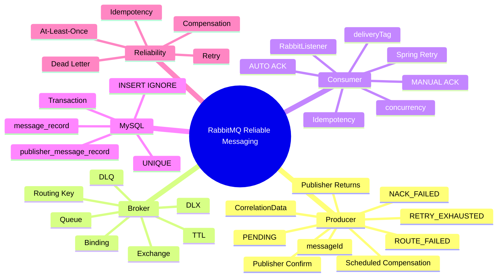
```mermaid
mindmap
  root((RabbitMQ Reliable Messaging))
    Producer
      messageId
      CorrelationData
      PENDING
      Publisher Confirm
      Publisher Returns
      ROUTE_FAILED
      NACK_FAILED
      Scheduled Compensation
      RETRY_EXHAUSTED
    Broker
      Exchange
      Routing Key
      Binding
      Queue
      TTL
      DLX
      DLQ
    Consumer
      RabbitListener
      concurrency
      deliveryTag
      AUTO ACK
      MANUAL ACK
      Spring Retry
      Idempotency
    MySQL
      publisher_message_record
      message_record
      UNIQUE
      INSERT IGNORE
      Transaction
    Reliability
      At-Least-Once
      Retry
      Dead Letter
      Compensation
      Idempotency
```

Mermaid 源文件见 `docs/diagrams/` 下同名 `.mmd` 文件。

</details>

一句话概括：

```text
Producer 负责“尽量可靠地发出去”
RabbitMQ 负责“路由、缓存、重投、死信”
Consumer 负责“即使收到重复消息也不能重复做业务”
MySQL 负责“记录状态、实现幂等与补偿依据”
```

---

## 2. 项目总体架构



<details>
<summary>查看 Mermaid 源码</summary>

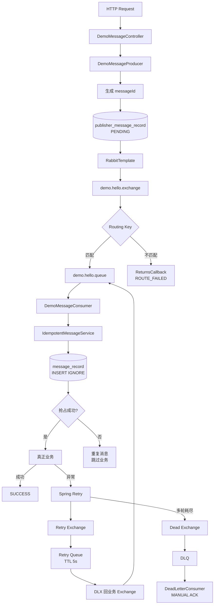
```mermaid
flowchart TD
    A[HTTP Request] --> B[DemoMessageController]
    B --> C[DemoMessageProducer]
    C --> D[生成 messageId]
    D --> E[(publisher_message_record<br/>PENDING)]
    E --> F[RabbitTemplate]
    F --> G[demo.hello.exchange]
    G --> H{Routing Key}
    H -->|匹配| I[demo.hello.queue]
    H -->|不匹配| R[ReturnsCallback<br/>ROUTE_FAILED]

    I --> J[DemoMessageConsumer]
    J --> K[IdempotentMessageService]
    K --> L[(message_record<br/>INSERT IGNORE)]
    L --> M{抢占成功?}
    M -->|是| N[真正业务]
    M -->|否| O[重复消息<br/>跳过业务]

    N -->|成功| P[SUCCESS]
    N -->|异常| Q[Spring Retry]
    Q --> S[Retry Exchange]
    S --> T[Retry Queue<br/>TTL 5s]
    T --> U[DLX 回业务 Exchange]
    U --> I

    Q -->|多轮耗尽| V[Dead Exchange]
    V --> W[DLQ]
    W --> X[DeadLetterConsumer<br/>MANUAL ACK]
```

Mermaid 源文件见 `docs/diagrams/` 下同名 `.mmd` 文件。

</details>

---

## 3. 源码导航

### 3.1 类关系图



<details>
<summary>查看 Mermaid 源码</summary>

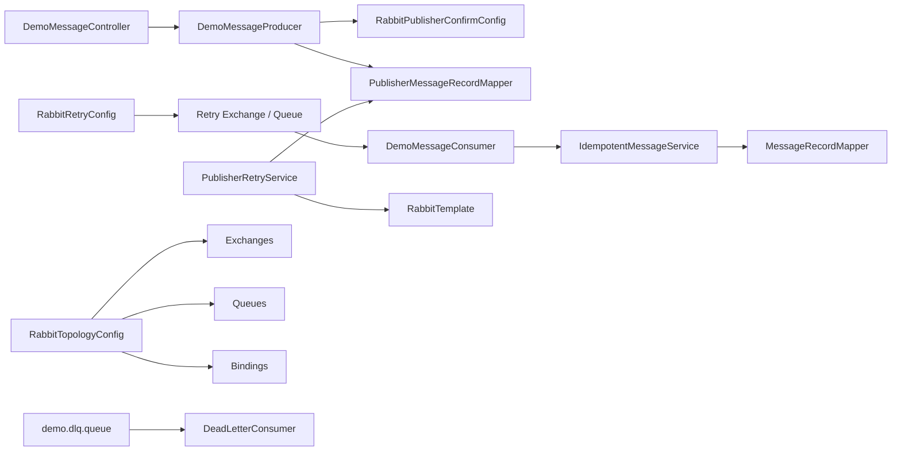
```mermaid
flowchart LR
    C[DemoMessageController] --> P[DemoMessageProducer]
    P --> PC[RabbitPublisherConfirmConfig]
    P --> PM[PublisherMessageRecordMapper]

    DMC[DemoMessageConsumer] --> IMS[IdempotentMessageService]
    IMS --> MM[MessageRecordMapper]

    RC[RabbitRetryConfig] --> RE[Retry Exchange / Queue]
    RE --> DMC

    PRS[PublisherRetryService] --> PM
    PRS --> RT[RabbitTemplate]

    RTC[RabbitTopologyConfig] --> EX[Exchanges]
    RTC --> QU[Queues]
    RTC --> BI[Bindings]

    DLQ[demo.dlq.queue] --> DLC[DeadLetterConsumer]
```

Mermaid 源文件见 `docs/diagrams/` 下同名 `.mmd` 文件。

</details>

### 3.2 文件职责

| 文件 | 作用 |
| --- | --- |
| `DemoMessageController` | 提供测试接口 |
| `DemoMessageProducer` | 正常发送、TTL 测试、幂等测试、错误 Routing Key 测试 |
| `RabbitPublisherConfirmConfig` | Publisher Confirm / ReturnsCallback |
| `RabbitTopologyConfig` | Exchange / Queue / Binding / TTL / DLX 拓扑 |
| `RabbitRetryConfig` | Spring Retry + MessageRecoverer |
| `DemoMessageConsumer` | 正常业务 Consumer |
| `DeadLetterConsumer` | 最终 DLQ Consumer + MANUAL ACK |
| `IdempotentMessageService` | 消费幂等 + 本地事务 |
| `PublisherRetryService` | Producer 失败消息自动补偿 |
| `MessageRecordMapper` | Consumer 幂等 SQL |
| `PublisherMessageRecordMapper` | Producer 状态跟踪与补偿 SQL |
| `RabbitmqDemoApplication` | Spring Boot 启动 + `@EnableScheduling` |

---

## 4. RabbitMQ 基础拓扑

### 4.1 Exchange、Queue、Binding、Routing Key 到底是什么

最简单的链路：

```text
Producer
   ↓
Exchange
   ↓  根据 Routing Key + Binding 匹配
Queue
   ↓
Consumer
```

#### Exchange

Exchange 不负责“长期保存消息”。

它更像：

```text
消息分发器 / 路由器
```

Producer 发消息时：

```java
rabbitTemplate.convertAndSend(
    exchange,
    routingKey,
    message
);
```

真正决定消息最终去哪一个 Queue 的，是：

```text
Exchange
+
Routing Key
+
Binding
```

---

### 4.2 当前业务拓扑

```text
Exchange:
demo.hello.exchange

Queue:
demo.hello.queue

Routing Key:
demo.hello
```

对应关系：


<details>
<summary>查看 Mermaid 源码</summary>


```mermaid
flowchart LR
    P[Producer] --> E[demo.hello.exchange]
    E -->|demo.hello| Q[demo.hello.queue]
    Q --> C[DemoMessageConsumer]
```

Mermaid 源文件见 `docs/diagrams/` 下同名 `.mmd` 文件。

</details>

---

### 4.3 Retry 拓扑

```text
Exchange:
demo.retry.exchange

Queue:
demo.retry.queue

Routing Key:
demo.retry
```

Retry Queue：

```text
TTL = 5000 ms
```

并配置：

```text
Dead Letter Exchange = demo.hello.exchange
Dead Letter Routing Key = demo.hello
```

所以：


<details>
<summary>查看 Mermaid 源码</summary>


```mermaid
flowchart LR
    A[业务失败] --> B[demo.retry.exchange]
    B --> C[demo.retry.queue]
    C -->|等待 5 秒| D[TTL expired]
    D --> E[DLX]
    E --> F[demo.hello.exchange]
    F --> G[demo.hello.queue]
    G --> H[Consumer 再次处理]
```

Mermaid 源文件见 `docs/diagrams/` 下同名 `.mmd` 文件。

</details>

---

### 4.4 最终死信拓扑

```text
Exchange:
demo.dlx.exchange

Queue:
demo.dlq.queue

Routing Key:
demo.dead
```


<details>
<summary>查看 Mermaid 源码</summary>

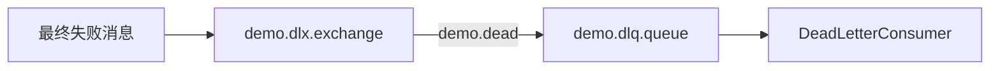
```mermaid
flowchart LR
    A[最终失败消息] --> B[demo.dlx.exchange]
    B -->|demo.dead| C[demo.dlq.queue]
    C --> D[DeadLetterConsumer]
```

Mermaid 源文件见 `docs/diagrams/` 下同名 `.mmd` 文件。

</details>

---

## 5. Producer 可靠发送

> [!NOTE]
> 第 5～8 章记录的是 Producer 可靠发送的完整设计与已经整理好的参考实现；当前公开分支缺少顶部状态表列出的 3 个源码组件，不能把这些章节理解为当前 `master` 已经可以运行的证明。

### 5.1 Producer 面临的真实问题

最简单的发送：

```java
rabbitTemplate.convertAndSend(
    "demo.hello.exchange",
    "demo.hello",
    message
);
```

代码执行完，并不能直接推出：

```text
消息一定已经进入 Queue
```

中间可能出问题：

```text
应用发送异常
RabbitMQ Broker 不可用
Broker 拒绝 publish
Exchange 不存在
Routing Key 错误
Exchange 找不到匹配 Queue
```

所以 Producer 可靠性至少要回答两个问题：

```text
问题 1：
Broker 有没有接收到 publish？

问题 2：
Broker 接收到以后，Exchange 有没有成功路由？
```

对应：

```text
Publisher Confirm
Publisher Returns
```

---

### 5.2 messageId

正常消息发送时：

```java
String messageId = UUID.randomUUID().toString();
```

这个 ID 是整条业务消息的“身份证”。

理想情况下：

```text
第一次发送
↓
Spring Retry
↓
Retry Queue
↓
重新投递
↓
Producer 补偿
```

同一条业务消息的：

```text
messageId
```

都应该保持不变。

---

### 5.3 MessageProperties.messageId 和 CorrelationData.id

它们看起来都存 messageId，但职责不同。



<details>
<summary>查看 Mermaid 源码</summary>

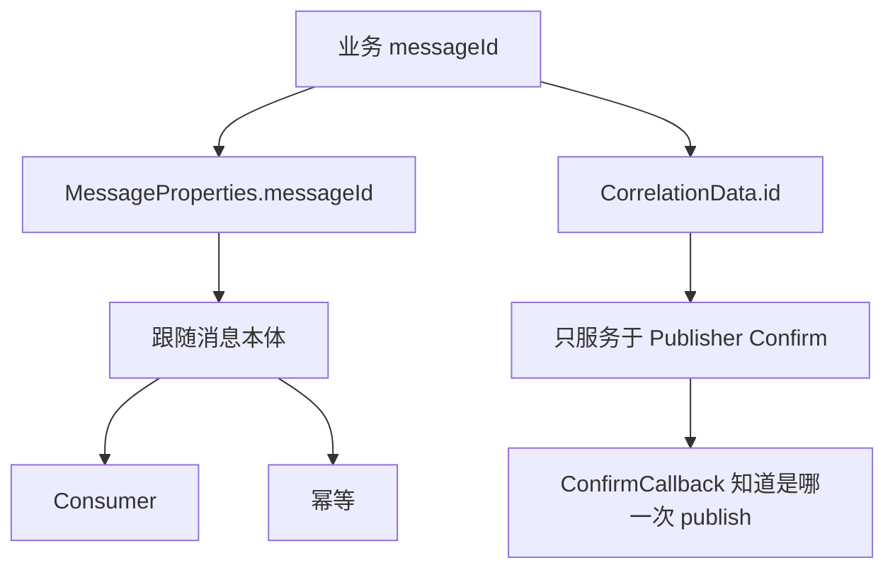
```mermaid
flowchart TD
    M[业务 messageId] --> A[MessageProperties.messageId]
    M --> B[CorrelationData.id]

    A --> C[跟随消息本体]
    C --> D[Consumer]
    C --> E[幂等]

    B --> F[只服务于 Publisher Confirm]
    F --> G[ConfirmCallback 知道是哪一次 publish]
```

Mermaid 源文件见 `docs/diagrams/` 下同名 `.mmd` 文件。

</details>

### MessageProperties.messageId

```java
rabbitMessage
    .getMessageProperties()
    .setMessageId(messageId);
```

作用：

```text
跟随消息
Consumer 能拿到
幂等能使用
日志能追踪
```

### CorrelationData

```java
CorrelationData correlationData =
        new CorrelationData(messageId);
```

作用：

```text
Producer 发送以后
ConfirmCallback 能知道
“这个 ack / nack 是哪条消息的”
```

---

### 5.4 发送前为什么先写 PENDING

当前普通 Producer 逻辑：

```text
生成 messageId
↓
publisher_message_record 插入 PENDING
↓
RabbitTemplate publish
```

不是：

```text
先 publish
↓
再落数据库
```

原因：

如果 publish 之前系统没有任何发送记录：

```text
应用发送过程中崩溃
↓
数据库没有记录
↓
后续连“有没有这条待发送消息”都不知道
```

所以先登记：

```text
PENDING
```

表示：

> “这条消息已经进入发送流程，但最终发送结果还没有确定。”

---

## 6. Publisher Confirm 与 Publisher Returns

### 6.1 Confirm 回答什么

Confirm 回答：

```text
Producer publish
      ↓
RabbitMQ Broker

Broker 有没有确认收到？
```

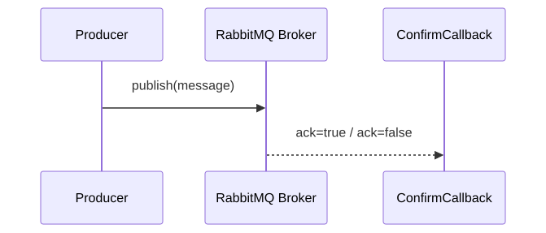

<details>
<summary>查看 Mermaid 源码</summary>

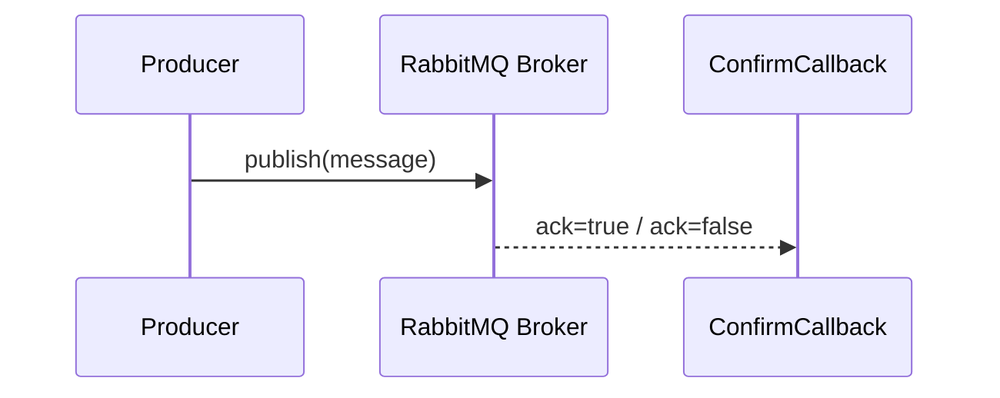
```mermaid
sequenceDiagram
    participant P as Producer
    participant R as RabbitMQ Broker
    participant C as ConfirmCallback

    P->>R: publish(message)
    R-->>C: ack=true / ack=false
```

Mermaid 源文件见 `docs/diagrams/` 下同名 `.mmd` 文件。

</details>

#### ack=true

代表：

```text
Broker 接受了这次 publish
```

#### ack=false

代表：

```text
Broker 没有成功接受 publish
```

---

### 6.2 Confirm 不回答什么

Confirm **不负责证明**：

```text
消息一定进入 Queue
Consumer 一定收到
Consumer 一定成功执行业务
```

错误理解：

```text
Confirm ack=true
=
业务成功
```

正确理解：

```text
Confirm ack=true
=
Broker 确认收到这次 publish
```

---

### 6.3 ReturnsCallback 回答什么

ReturnsCallback 重点处理：

```text
Exchange 收到了消息
但是找不到任何匹配 Queue
```

项目故意使用：

```text
routingKey = demo.hello.WRONG
```

因为 Binding 实际绑定的是：

```text
demo.hello
```

所以：

```text
demo.hello.WRONG
```

无法匹配。

RabbitMQ 返回：

```text
replyCode = 312
replyText = NO_ROUTE
```

---

### 6.4 为什么 Confirm=true 还能 NO_ROUTE

这是最容易混的点之一。

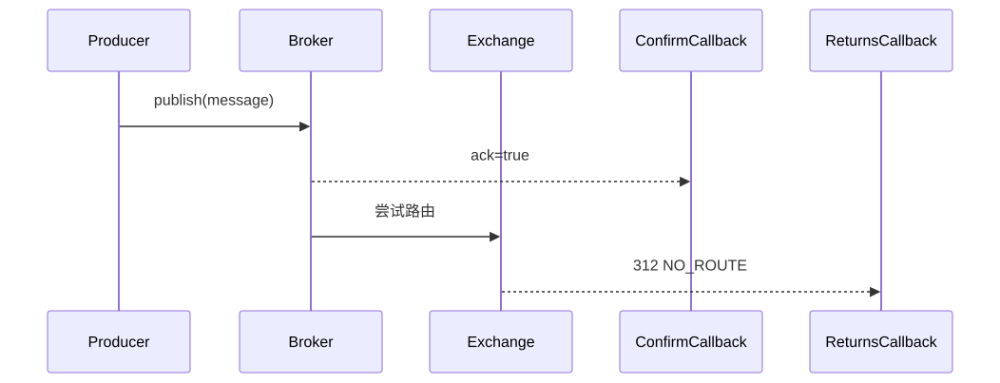

<details>
<summary>查看 Mermaid 源码</summary>

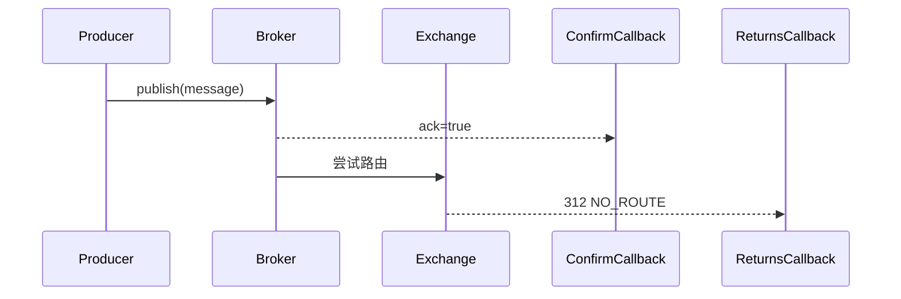
```mermaid
sequenceDiagram
    participant P as Producer
    participant R as Broker
    participant E as Exchange
    participant C as ConfirmCallback
    participant RT as ReturnsCallback

    P->>R: publish(message)
    R-->>C: ack=true
    R->>E: 尝试路由
    E-->>RT: 312 NO_ROUTE
```

Mermaid 源文件见 `docs/diagrams/` 下同名 `.mmd` 文件。

</details>

所以：

```text
Confirm ack=true
```

说明：

```text
Broker 收到了
```

但：

```text
Return NO_ROUTE
```

说明：

```text
Exchange 没找到 Queue
```

两者完全可以同时成立。

---

### 6.5 Confirm / Return 回调乱序

异步回调不能假定固定顺序。

可能是：

```text
Confirm → Return
```

也可能是：

```text
Return → Confirm
```

这会影响数据库状态。

---

### 6.6 错误方案

如果 Confirm 成功直接：

```sql
UPDATE publisher_message_record
SET status = 'CONFIRMED'
WHERE message_id = #{messageId};
```

会出现：

```text
Return 先到
↓
ROUTE_FAILED

Confirm 后到
↓
CONFIRMED
```

最终数据库变成：

```text
CONFIRMED
```

但事实上消息根本没进 Queue。

这是错误状态。

---

### 6.7 当前正确方案：状态保护

当前 SQL：

```sql
UPDATE publisher_message_record
SET status = 'CONFIRMED',
    update_time = NOW(6)
WHERE message_id = #{messageId}
  AND status = 'PENDING';
```

关键：

```sql
AND status = 'PENDING'
```

它限制：

```text
只有 PENDING
才能变 CONFIRMED
```

---

### 6.8 Return 先到的完整流程

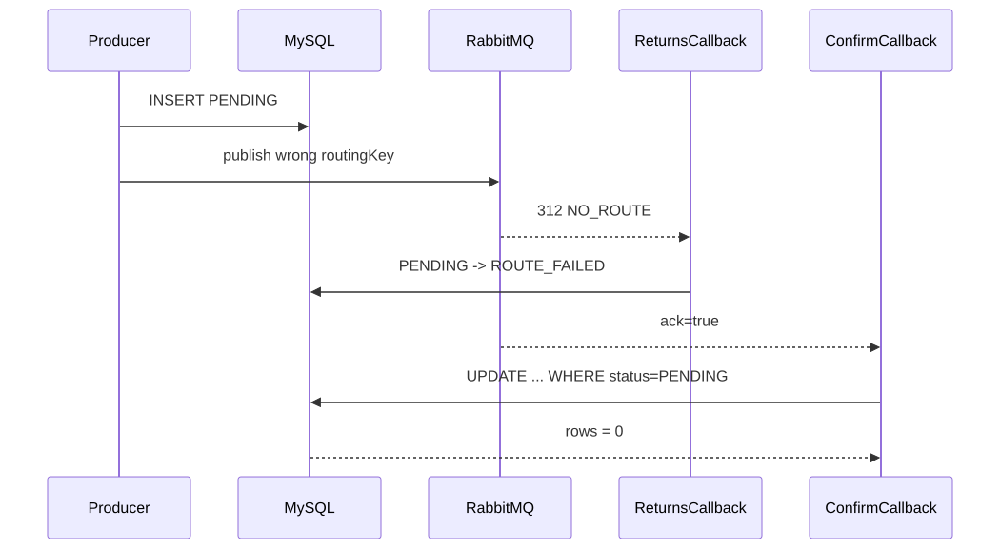

<details>
<summary>查看 Mermaid 源码</summary>

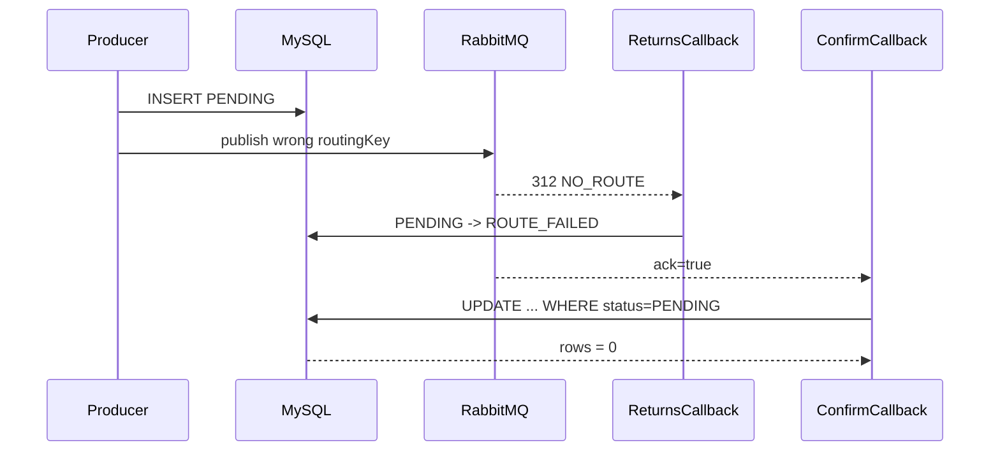
```mermaid
sequenceDiagram
    participant P as Producer
    participant DB as MySQL
    participant R as RabbitMQ
    participant RT as ReturnsCallback
    participant C as ConfirmCallback

    P->>DB: INSERT PENDING
    P->>R: publish wrong routingKey

    R-->>RT: 312 NO_ROUTE
    RT->>DB: PENDING -> ROUTE_FAILED

    R-->>C: ack=true
    C->>DB: UPDATE ... WHERE status=PENDING
    DB-->>C: rows = 0
```

Mermaid 源文件见 `docs/diagrams/` 下同名 `.mmd` 文件。

</details>

最终：

```text
ROUTE_FAILED
```

不会被覆盖。

---

### 6.9 面试一句话

> Producer 端我使用 Publisher Confirm 判断 Broker 是否接受 publish，使用 ReturnsCallback 判断 Exchange 是否成功路由。由于两个回调都是异步的，不能假设顺序，所以我对数据库状态迁移做了约束，`CONFIRMED` 只允许由 `PENDING` 迁移，防止后到的 Confirm 覆盖已经确定的 `ROUTE_FAILED`。

---

## 7. Producer 状态机



<details>
<summary>查看 Mermaid 源码</summary>

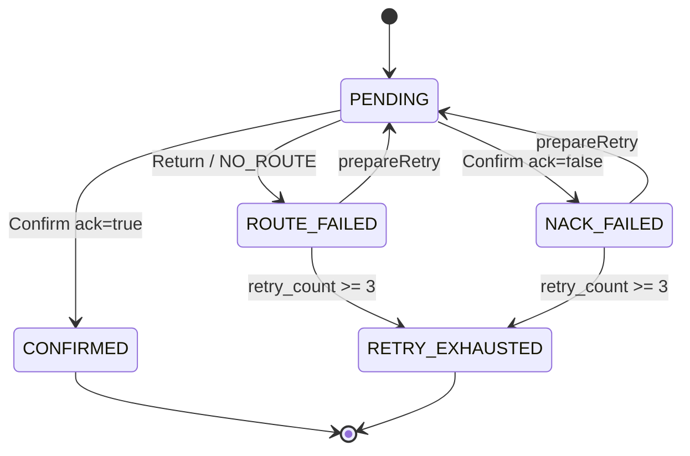
```mermaid
stateDiagram-v2
    [*] --> PENDING

    PENDING --> CONFIRMED: Confirm ack=true
    PENDING --> NACK_FAILED: Confirm ack=false
    PENDING --> ROUTE_FAILED: Return / NO_ROUTE

    ROUTE_FAILED --> PENDING: prepareRetry
    NACK_FAILED --> PENDING: prepareRetry

    ROUTE_FAILED --> RETRY_EXHAUSTED: retry_count >= 3
    NACK_FAILED --> RETRY_EXHAUSTED: retry_count >= 3

    CONFIRMED --> [*]
    RETRY_EXHAUSTED --> [*]
```

Mermaid 源文件见 `docs/diagrams/` 下同名 `.mmd` 文件。

</details>

### 7.1 状态含义

| 状态 | 含义 |
| --- | --- |
| `PENDING` | 正在等待当前发送结果 |
| `CONFIRMED` | Broker Confirm 成功，并且状态保护允许迁移 |
| `NACK_FAILED` | Broker Confirm nack |
| `ROUTE_FAILED` | Exchange 无法路由 |
| `RETRY_EXHAUSTED` | 自动补偿次数耗尽 |

---

## 8. Producer 自动补偿

### 8.1 为什么需要补偿

如果一条消息：

```text
ROUTE_FAILED
```

只记录失败状态但不处理，那么可靠性只做了一半。

需要一个机制：

```text
扫描失败消息
↓
重新发送
↓
成功就结束
↓
失败继续记录
↓
达到上限就停止
```

当前使用：

```java
@Scheduled(fixedDelay = 10000)
```

---

### 8.2 fixedDelay 的含义

不是：

```text
每个自然时间点整 10 秒启动
```

而是：

```text
本轮任务开始
↓
本轮任务结束
↓
等待 10 秒
↓
下一轮
```

因此测试时第一轮补偿可能距离“刚刚发送失败”的时间不足 10 秒。

因为 Scheduler 在应用启动后就已经一直运行。

---

### 8.3 为什么不能直接重新发

假设：

```text
ROUTE_FAILED
retry_count = 1
```

直接：

```text
RabbitTemplate 再发一次
```

如果这次成功：

```text
Confirm ack=true
```

但 `markConfirmed()` 只允许：

```text
PENDING -> CONFIRMED
```

当前还是：

```text
ROUTE_FAILED
```

所以更新会失败。

---

### 8.4 prepareRetry

于是增加：

```text
prepareRetry
```

在真正重新 publish 前，原子完成：

```text
ROUTE_FAILED / NACK_FAILED
          ↓
PENDING
retry_count + 1
last_retry_time = now
```

关键 SQL：

```sql
UPDATE publisher_message_record
SET status = 'PENDING',
    retry_count = retry_count + 1,
    last_retry_time = NOW(6),
    update_time = NOW(6)
WHERE message_id = #{messageId}
  AND status IN ('ROUTE_FAILED', 'NACK_FAILED')
  AND retry_count < #{maxRetryCount};
```

---

### 8.5 prepareRetry 还有一个作用：抢重试资格

如果未来多个任务同时尝试补偿：

```text
Task A
Task B
```

它们都可能查到同一条失败记录。

通过：

```text
UPDATE ... WHERE status IN (...) AND retry_count < max
```

只有真正更新成功的任务：

```text
rows = 1
```

才继续发送。

如果：

```text
rows = 0
```

当前代码直接：

```java
continue;
```

说明：

```text
消息可能已被其他任务处理
或者已经不能再重试
```

---

### 8.6 Producer 补偿流程



<details>
<summary>查看 Mermaid 源码</summary>

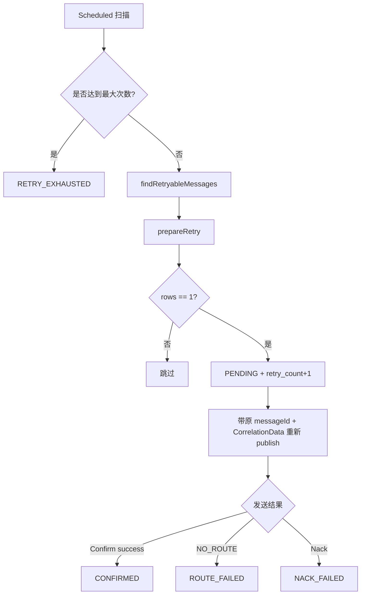
```mermaid
flowchart TD
    A[Scheduled 扫描] --> B{是否达到最大次数?}
    B -->|是| C[RETRY_EXHAUSTED]
    B -->|否| D[findRetryableMessages]
    D --> E[prepareRetry]
    E --> F{rows == 1?}
    F -->|否| G[跳过]
    F -->|是| H[PENDING + retry_count+1]
    H --> I[带原 messageId + CorrelationData 重新 publish]
    I --> J{发送结果}
    J -->|Confirm success| K[CONFIRMED]
    J -->|NO_ROUTE| L[ROUTE_FAILED]
    J -->|Nack| M[NACK_FAILED]
```

Mermaid 源文件见 `docs/diagrams/` 下同名 `.mmd` 文件。

</details>

---

### 8.7 RETRY_EXHAUSTED

当前最大自动补偿次数：

```text
3
```

达到：

```text
retry_count >= 3
```

且仍然：

```text
ROUTE_FAILED / NACK_FAILED
```

则：

```text
RETRY_EXHAUSTED
```

为什么必须有限制：

```text
配置永久错误
↓
每次都失败
↓
无限重发
↓
无意义流量 + 日志爆炸 + 系统压力
```

最终应该：

```text
RETRY_EXHAUSTED
↓
告警
↓
人工处理
```

---

### 8.8 实际测试

请求：

```http
POST /api/demo/send-unroutable?message=auto-retry-test
```

实际链路：

```text
初始发送
↓
ROUTE_FAILED

补偿 #1
↓
ROUTE_FAILED

补偿 #2
↓
ROUTE_FAILED

补偿 #3
↓
ROUTE_FAILED

下一轮 Scheduler
↓
RETRY_EXHAUSTED
```

实际日志中同一个：

```text
messageId=eff54aa1-7f5f-4771-a13a-b874a5530264
```

始终保持不变。

---

## 9. Consumer 消费链路

Consumer：

```java
@RabbitListener(
    queues = "demo.hello.queue",
    containerFactory = "retryRabbitListenerContainerFactory",
    concurrency = "2"
)
```

核心参数：

```text
queues
=
监听哪个 Queue

containerFactory
=
使用哪套 Listener Container 配置

concurrency = 2
=
同时启动两个并发 Consumer
```

---

### 9.1 Consumer 获取到的信息

```java
long deliveryTag =
        message.getMessageProperties().getDeliveryTag();

String messageId =
        message.getMessageProperties().getMessageId();

Boolean redelivered =
        message.getMessageProperties().isRedelivered();
```

---

### 9.2 deliveryTag

`deliveryTag` 不是全局唯一 ID。

正确理解：

```text
deliveryTag
=
当前 Channel 范围内
RabbitMQ 对投递进行编号
```

因此：

```text
Channel A 的 deliveryTag=1
Channel B 的 deliveryTag=1
```

可以同时存在。

这不是重复消息的证据。

---

### 9.3 messageId 才是业务幂等核心

```text
deliveryTag
=
本次 RabbitMQ 投递标识

messageId
=
这条业务消息的身份
```

Consumer 幂等应该使用：

```text
messageId
```

而不是：

```text
deliveryTag
```

---

## 10. Consumer 幂等

### 10.1 为什么幂等是必修

RabbitMQ 可靠消息系统必须接受一个事实：

```text
消息可能重复投递
```

原因可能包括：

```text
ACK 丢失
Consumer 断线
重试
Retry Queue
Producer 补偿
网络故障
```

所以设计目标不是：

```text
RabbitMQ 永远不重复
```

而是：

```text
就算 RabbitMQ 重复
业务也不能重复
```

---

### 10.2 V1：先查再处理

最直觉：

```text
SELECT messageId
↓
不存在
↓
执行真正业务
↓
INSERT
```

单线程看起来没问题。

---

### 10.3 并发 Race Condition

Consumer 设置：

```text
concurrency = 2
```

两个 Consumer 同时收到相同 messageId：

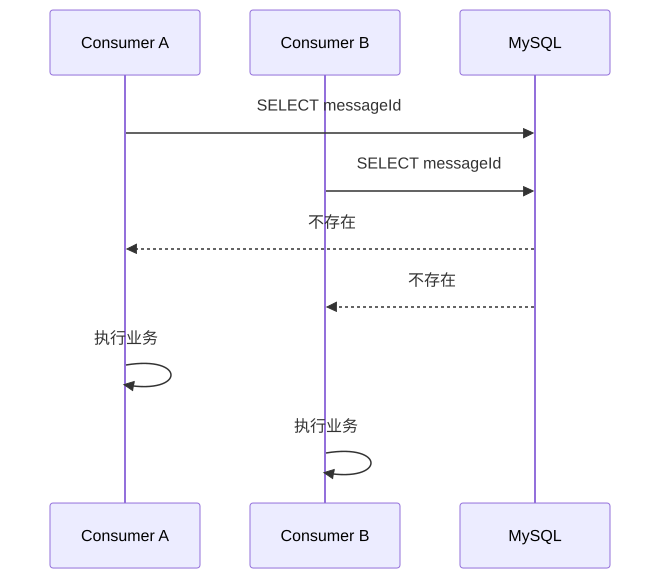

<details>
<summary>查看 Mermaid 源码</summary>

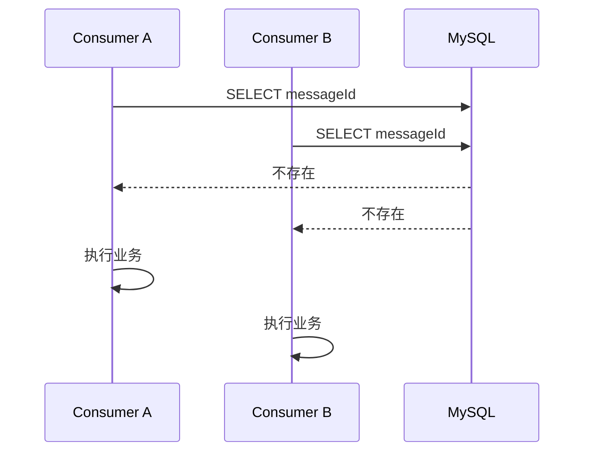
```mermaid
sequenceDiagram
    participant A as Consumer A
    participant B as Consumer B
    participant DB as MySQL

    A->>DB: SELECT messageId
    B->>DB: SELECT messageId
    DB-->>A: 不存在
    DB-->>B: 不存在

    A->>A: 执行业务
    B->>B: 执行业务
```

Mermaid 源文件见 `docs/diagrams/` 下同名 `.mmd` 文件。

</details>

这就是：

```text
Check-Then-Act Race Condition
```

---

### 10.4 为什么 SELECT + INSERT 不够

问题在于：

```text
检查
和
执行
```

不是同一个原子动作。

两个线程都可能在 INSERT 前完成检查。

---

### 10.5 最终方案：UNIQUE + INSERT IGNORE

当前 Mapper SQL：

```sql
INSERT IGNORE INTO message_record
(
    message_id,
    status,
    create_time
)
VALUES
(
    #{messageId},
    'PROCESSING',
    NOW()
);
```

并依赖：

```text
message_id 唯一约束
```

---

### 10.6 原子抢占流程

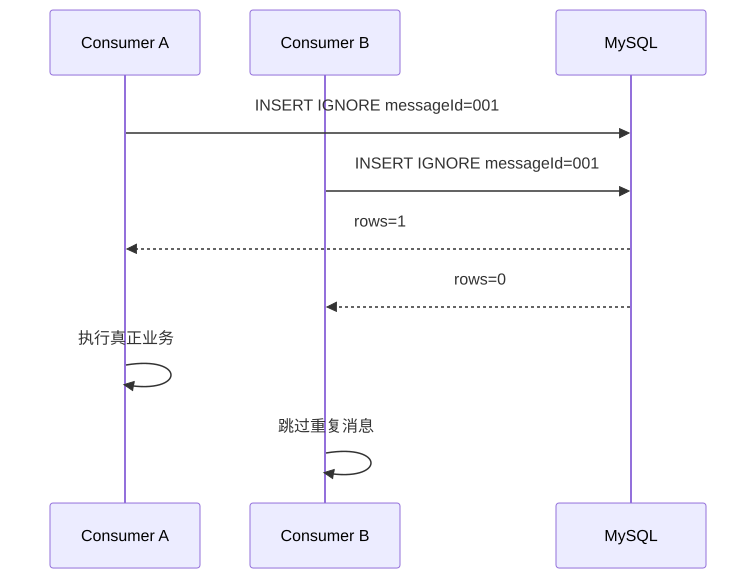

<details>
<summary>查看 Mermaid 源码</summary>

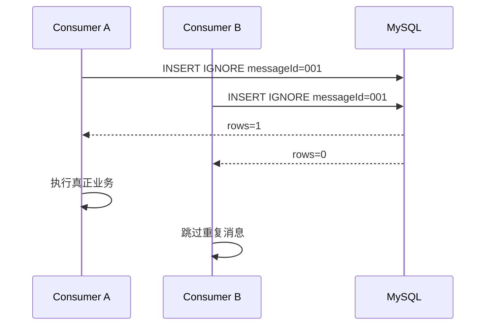
```mermaid
sequenceDiagram
    participant A as Consumer A
    participant B as Consumer B
    participant DB as MySQL

    A->>DB: INSERT IGNORE messageId=001
    B->>DB: INSERT IGNORE messageId=001

    DB-->>A: rows=1
    DB-->>B: rows=0

    A->>A: 执行真正业务
    B->>B: 跳过重复消息
```

Mermaid 源文件见 `docs/diagrams/` 下同名 `.mmd` 文件。

</details>

当前 Java：

```java
if (messageRecordMapper.tryAcquireMessage(messageId) == 0) {
    log.warn("重复消息，跳过业务处理");
    return;
}
```

---

### 10.7 为什么叫“抢占”

成功：

```text
rows = 1
```

代表：

> “这条 messageId 的处理资格被当前 Consumer 抢到了。”

失败：

```text
rows = 0
```

代表：

> “数据库已经存在同一个唯一 messageId，当前 Consumer 不再做业务。”

---

### 10.8 `@Transactional` 为什么很重要

Service：

```java
@Transactional
```

流程：

```text
INSERT PROCESSING
↓
执行业务
↓
markSuccess
↓
提交事务
```

如果业务异常：

```text
INSERT PROCESSING
↓
执行业务
↓
RuntimeException
↓
rollback
```

则：

```text
PROCESSING 插入也一起回滚
```

下一轮 RabbitMQ Retry：

```text
还能重新 INSERT
↓
还能重新获得处理资格
```

---

### 10.9 事务边界

当前事务可以保护：

```text
MySQL INSERT
MySQL UPDATE
MySQL 业务表
```

但不能自动回滚：

```text
短信
HTTP 第三方调用
文件上传
外部支付
远程 RPC
```

所以生产系统如果有外部副作用，还需要：

```text
业务幂等
补偿机制
Outbox
最终一致性
```

---

## 11. Spring Retry

### 11.1 当前配置

当前：

```text
stateless
maxAttempts(2)
```

也就是：

```text
第一次执行
↓
失败
↓
再执行一次
```

两次都失败：

```text
MessageRecoverer
```

---

### 11.2 Spring Retry 在哪里发生

```text
Java JVM 内
```

不是：

```text
RabbitMQ Broker 重新投递
```

所以：

```text
同一个 Listener 方法
被 Spring Retry 再次调用
```

---

### 11.3 Spring Retry 时间线

以实际测试为例：

```text
18:42:51
第一次 Consumer 执行业务
↓
失败

18:42:54
Spring Retry 第二次调用
↓
失败

18:42:56
MessageRecoverer
retryCount 0 → 1
↓
进入 Retry Queue
```

这部分属于：

```text
JVM 内快速重试
```

---

### 11.4 当前 Backoff

当前代码：

```java
backOffOptions(1000, 1.0, 5000)
```

含义：

```text
initialInterval = 1000ms
multiplier = 1.0
maxInterval = 5000ms
```

注意：

```text
multiplier = 1.0
```

并不是真正指数退避。

应用启动时也会出现：

```text
Multiplier must be > 1.0 for effective exponential backoff
```

如果未来要真正指数退避，可以改成：

```java
backOffOptions(1000, 2.0, 5000)
```

---

## 12. Retry Queue、TTL、DLX、DLQ

### 12.1 为什么 Spring Retry 之外还要 Retry Queue

如果数据库：

```text
短暂网络抖动 100ms
```

可以快速 Retry。

但如果依赖服务：

```text
预计 5 秒以后恢复
```

一直在 JVM 里疯狂调用没有意义。

所以：

```text
Spring Retry
=
短周期快速重试

Retry Queue
=
隔一段时间以后再试
```

---

### 12.2 双层 Retry



<details>
<summary>查看 Mermaid 源码</summary>

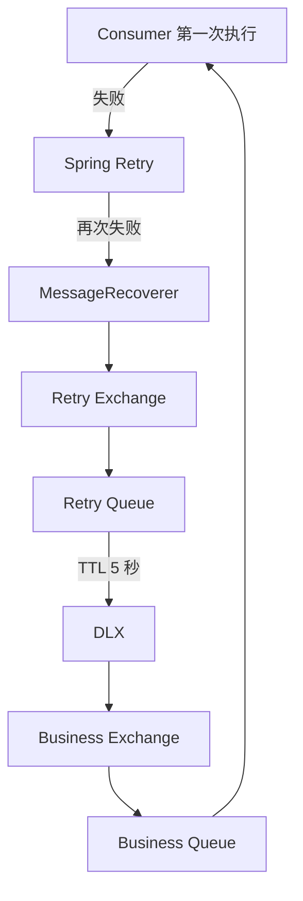
```mermaid
flowchart TD
    A[Consumer 第一次执行] -->|失败| B[Spring Retry]
    B -->|再次失败| C[MessageRecoverer]
    C --> D[Retry Exchange]
    D --> E[Retry Queue]
    E -->|TTL 5 秒| F[DLX]
    F --> G[Business Exchange]
    G --> H[Business Queue]
    H --> A
```

Mermaid 源文件见 `docs/diagrams/` 下同名 `.mmd` 文件。

</details>

这是两层不同的 Retry：

```text
第一层：
Spring Retry
JVM 内

第二层：
Retry Queue
Broker 内
```

---

### 12.3 MessageRecoverer

当 Spring Retry 耗尽：

```text
retryCount < maxRetryCount
↓
复制 Message
↓
retryCount + 1
↓
发送 Retry Exchange
```

否则：

```text
发送 Dead Exchange
```

---

### 12.4 MessageBuilder.fromMessage

当前：

```java
Message retryMessage =
        MessageBuilder
            .fromMessage(message)
            .build();
```

作用：

```text
基于原消息构建新 Message
```

并尽量保留原有消息属性。

因此原来的：

```text
messageId
```

仍然能够跟随消息。

---

### 12.5 TTL

Retry Queue：

```text
TTL = 5000 ms
```

消息进入：

```text
demo.retry.queue
```

等待 5 秒。

到期：

```text
expired
```

如果配置了 DLX：

```text
RabbitMQ 自动 dead-letter
```

---

### 12.6 DLX

DLX 全称：

```text
Dead Letter Exchange
```

它本质仍然是一个普通 Exchange。

“Dead Letter”只是：

```text
消息因为某种原因被 RabbitMQ 重新投递到指定 Exchange
```

---

### 12.7 常见 x-death reason

```text
rejected
expired
maxlen
delivery_limit
```

#### rejected

Consumer 拒绝：

```text
requeue=false
```

#### expired

消息 TTL 到期。

#### maxlen

Queue 超过最大长度。

#### delivery_limit

Quorum Queue 超过最大投递次数。

---

### 12.8 x-death 是历史

最终 DLQ 测试中曾看到：

```text
reason = expired
queue = demo.retry.queue
```

虽然最终消息是应用主动发到 Dead Exchange。

原因：

```text
消息之前经过 Retry Queue
↓
TTL expired
↓
RabbitMQ 写入 x-death
↓
后续消息继续携带这个 header
```

所以：

```text
x-death
```

更准确理解为：

```text
这条消息的死信历史
```

不是：

```text
最终进入当前 Queue 的唯一原因
```

---

### 12.9 最终 DLQ MANUAL ACK

当前：

```java
@RabbitListener(
    queues = "demo.dlq.queue",
    ackMode = "MANUAL"
)
```

处理成功：

```java
channel.basicAck(
    deliveryTag,
    false
);
```

处理失败：

```java
channel.basicNack(
    deliveryTag,
    false,
    false
);
```

---

### 12.10 basicAck 第二个参数

```java
basicAck(
    deliveryTag,
    multiple
)
```

当前：

```text
multiple = false
```

表示：

```text
只确认当前这一条
```

---

### 12.11 basicNack 三个参数

```java
basicNack(
    deliveryTag,
    multiple,
    requeue
)
```

当前：

```text
deliveryTag
=
当前投递

multiple=false
=
只处理当前一条

requeue=false
=
不重新放回 Queue
```

---

### 12.12 为什么 DLQ 不建议 requeue=true

如果：

```text
最终 DLQ Consumer
↓
处理失败
↓
requeue=true
↓
重新进入 DLQ
↓
再次处理
↓
再次失败
```

可能变成：

```text
无限消费循环
```

所以最终 DLQ 通常更倾向：

```text
记录
告警
持久化失败详情
人工处理
然后 ACK / 不 requeue
```

---

## 13. 两张数据库表职责



<details>
<summary>查看 Mermaid 源码</summary>

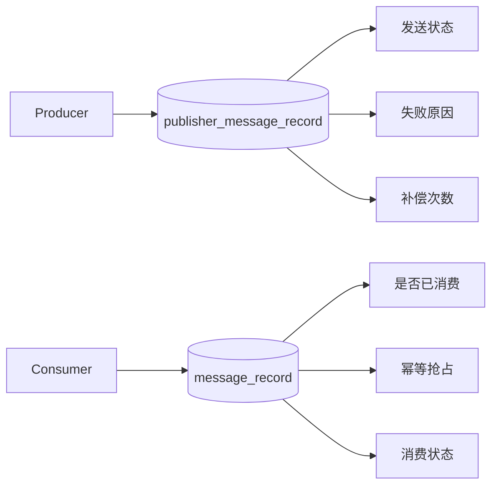
```mermaid
flowchart LR
    P[Producer] --> PM[(publisher_message_record)]
    C[Consumer] --> CM[(message_record)]

    PM --> A[发送状态]
    PM --> B[失败原因]
    PM --> D[补偿次数]

    CM --> E[是否已消费]
    CM --> F[幂等抢占]
    CM --> G[消费状态]
```

Mermaid 源文件见 `docs/diagrams/` 下同名 `.mmd` 文件。

</details>

### 13.1 publisher_message_record

负责：

```text
Producer 发送可靠性
```

主要关注：

```text
message_id
message_body
exchange_name
routing_key
status
failure_reason
retry_count
last_retry_time
```

---

### 13.2 message_record

负责：

```text
Consumer 幂等
```

主要关注：

```text
message_id
status
create_time
```

---

### 13.3 一句话区分

```text
publisher_message_record
=
“我有没有可靠地把消息送出去？”

message_record
=
“这条消息的业务是不是已经有人处理过？”
```

---

## 14. 端到端完整链路

### 14.1 正常成功



<details>
<summary>查看 Mermaid 源码</summary>

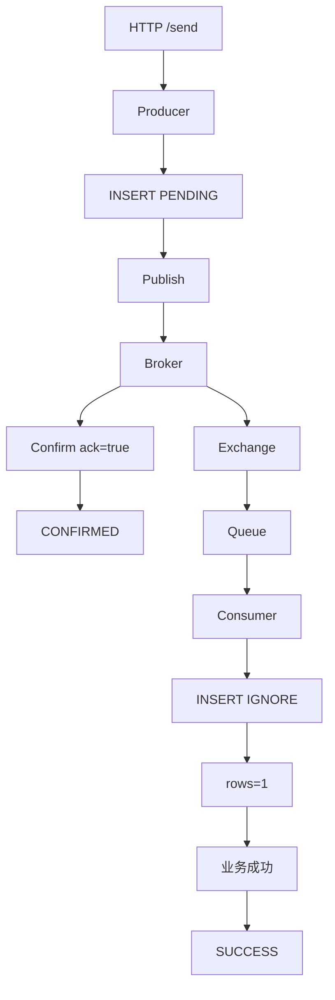
```mermaid
flowchart TD
    A[HTTP /send] --> B[Producer]
    B --> C[INSERT PENDING]
    C --> D[Publish]
    D --> E[Broker]
    E --> F[Confirm ack=true]
    F --> G[CONFIRMED]
    E --> H[Exchange]
    H --> I[Queue]
    I --> J[Consumer]
    J --> K[INSERT IGNORE]
    K --> L[rows=1]
    L --> M[业务成功]
    M --> N[SUCCESS]
```

Mermaid 源文件见 `docs/diagrams/` 下同名 `.mmd` 文件。

</details>

---

### 14.2 路由失败



<details>
<summary>查看 Mermaid 源码</summary>

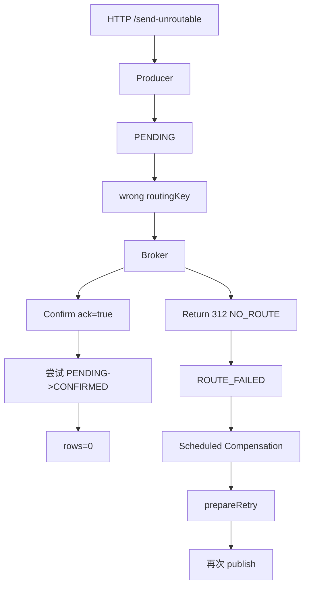
```mermaid
flowchart TD
    A[HTTP /send-unroutable] --> B[Producer]
    B --> C[PENDING]
    C --> D[wrong routingKey]
    D --> E[Broker]
    E --> F[Confirm ack=true]
    E --> G[Return 312 NO_ROUTE]
    G --> H[ROUTE_FAILED]
    F --> I[尝试 PENDING->CONFIRMED]
    I --> J[rows=0]
    H --> K[Scheduled Compensation]
    K --> L[prepareRetry]
    L --> M[再次 publish]
```

Mermaid 源文件见 `docs/diagrams/` 下同名 `.mmd` 文件。

</details>

---

### 14.3 消费持续失败



<details>
<summary>查看 Mermaid 源码</summary>

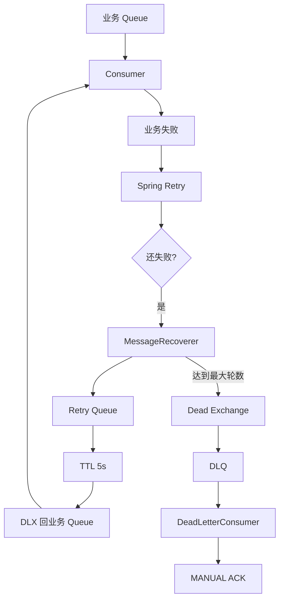
```mermaid
flowchart TD
    A[业务 Queue] --> B[Consumer]
    B --> C[业务失败]
    C --> D[Spring Retry]
    D --> E{还失败?}
    E -->|是| F[MessageRecoverer]
    F --> G[Retry Queue]
    G --> H[TTL 5s]
    H --> I[DLX 回业务 Queue]
    I --> B
    F -->|达到最大轮数| J[Dead Exchange]
    J --> K[DLQ]
    K --> L[DeadLetterConsumer]
    L --> M[MANUAL ACK]
```

Mermaid 源文件见 `docs/diagrams/` 下同名 `.mmd` 文件。

</details>

---

### 14.4 重复消息



<details>
<summary>查看 Mermaid 源码</summary>

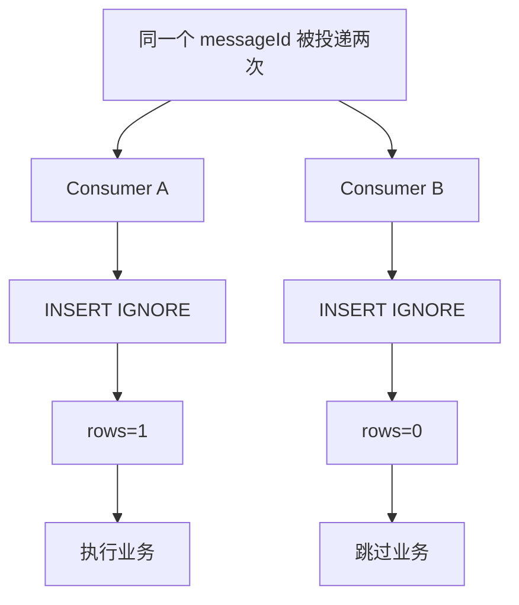
```mermaid
flowchart TD
    A[同一个 messageId 被投递两次] --> B[Consumer A]
    A --> C[Consumer B]
    B --> D[INSERT IGNORE]
    C --> E[INSERT IGNORE]
    D --> F[rows=1]
    E --> G[rows=0]
    F --> H[执行业务]
    G --> I[跳过业务]
```

Mermaid 源文件见 `docs/diagrams/` 下同名 `.mmd` 文件。

</details>

---

## 15. 实际测试记录

### 15.1 Producer 自动补偿测试

本次真实测试使用同一个 `messageId`：

```text
eff54aa1-7f5f-4771-a13a-b874a5530264
```

消息：

```text
auto-retry-test
```

Routing Key：

```text
demo.hello.WRONG
```

日志关键过程：

```text
Producer发送路由失败测试消息
↓
312 NO_ROUTE
↓
Confirm成功，数据库更新行数=0
↓
准备自动补偿重发，本轮重试次数=1
↓
NO_ROUTE
↓
准备自动补偿重发，本轮重试次数=2
↓
NO_ROUTE
↓
准备自动补偿重发，本轮重试次数=3
↓
NO_ROUTE
↓
消息自动补偿次数已耗尽
status=RETRY_EXHAUSTED
```

这里 `Confirm` 成功但数据库 `rows=0` 不是更新异常：`Return` 已先把 `PENDING` 改为 `ROUTE_FAILED`，而 `markConfirmed` 只允许 `PENDING -> CONFIRMED`，因此后到的 Confirm 无法覆盖路由失败事实。

验收：

```text
自动执行
messageId 不变
retry_count 0 → 1 → 2 → 3
最终 RETRY_EXHAUSTED
```

---

### 15.2 Consumer Retry + DLQ 测试

本次真实测试使用的 `messageId`：

```text
0200604c-9410-438b-920a-06ea10bb1a58
```

消息：

```text
retry-test
```

Service 中：

```text
messageBody.contains("retry")
```

主动抛 RuntimeException。

实际时间线：

```text
18:42:51
Consumer 第一次执行
↓
失败

18:42:54
Spring Retry 第二次执行
↓
失败

18:42:56
MessageRecoverer
retryCount 0 → 1

18:43:01
Retry Queue TTL 到期
↓
重新消费

18:43:03
失败

18:43:04
Spring Retry
↓
失败

18:43:06
retryCount 1 → 2

18:43:11
再次返回业务 Queue
↓
继续失败

18:43:16
最终进入 DLQ
↓
DeadLetterConsumer
↓
MANUAL ACK
```

最终日志：

```text
x-death: reason=expired, queue=demo.retry.queue
DLQ 消息处理成功，已手动 ACK
```

`x-death` 在这里记录的是消息曾经从 `demo.retry.queue` 因 TTL 到期而死信转发的历史；最终进入 DLQ 的动作是 `MessageRecoverer` 主动发往 Dead Exchange，不能把 `expired` 误写成最终入 DLQ 的唯一原因。验收通过。

---

## 16. 消息积压怎么处理

面试高频：

> RabbitMQ 积压几百万条消息怎么办？

先不要直接回答：

```text
加消费者
```

正确思路：



<details>
<summary>查看 Mermaid 源码</summary>

```mermaid
flowchart TD
    A[发现 Queue backlog] --> B[先定位原因]
    B --> C{生产突然增大?}
    B --> D{消费能力下降?}
    B --> E{下游变慢?}

    C --> F[临时限流 / 削峰]
    D --> G[扩容 Consumer]
    E --> H[优化 DB / RPC / 外部依赖]

    G --> I[提高 concurrency]
    I --> J[观察下游容量]
```

Mermaid 源文件见 `docs/diagrams/` 下同名 `.mmd` 文件。

</details>

---

### 16.1 根本公式

```text
生产速度 > 消费速度
```

长期成立：

```text
Queue 一定持续增长
```

所以最终必须让：

```text
消费能力 >= 生产速度
```

---

### 16.2 处理步骤

第一步：

```text
看 Queue Ready / Unacked
```

第二步：

```text
看 Consumer 是否存活
```

第三步：

```text
看业务处理耗时
```

第四步：

```text
看 MySQL / Redis / RPC / 第三方接口
```

第五步：

```text
合理增加 Consumer 实例
或者提高 concurrency
```

但不能盲目：

```text
Consumer 从 10 扩到 500
↓
RabbitMQ 消费很快
↓
MySQL 被打死
```

系统吞吐取决于：

```text
最慢的那个下游
```

---

## 17. 项目演化史

这部分很重要。

面试真正有价值的不是：

```text
“我会写最终代码”
```

而是：

```text
“我知道为什么从旧方案改成新方案”
```

---

### 17.1 幂等演化

```text
V1
exists / SELECT 判断
↓
问题：
并发 Race

V2
SELECT + INSERT
↓
问题：
仍然是 Check-Then-Act

V3
UNIQUE + INSERT IGNORE
↓
数据库原子抢占

V4
@Transactional
↓
抢占 + DB业务 + SUCCESS
放在同一事务
```

---

### 17.2 Producer 可靠性演化

```text
V1
直接 RabbitTemplate 发送
↓
问题：
不知道结果

V2
Publisher Confirm
↓
问题：
Confirm 成功不等于路由成功

V3
Confirm + Return
↓
问题：
回调乱序可能覆盖状态

V4
状态保护
PENDING -> CONFIRMED

V5
失败落库
↓
Scheduled 补偿

V6
prepareRetry
↓
失败状态重新进入 PENDING
↓
retry_count + 1

V7
RETRY_EXHAUSTED
↓
避免无限补偿
```

---

### 17.3 Consumer Retry 演化

```text
直接失败
↓
Spring Retry

只做快速 Retry
↓
恢复窗口太短

增加 Retry Queue
↓
TTL + DLX 延迟重试

仍然一直失败
↓
最终 DLQ

DLQ 消费
↓
MANUAL ACK
```

---

## 18. 当前项目已知边界

这一节不是“项目做得差”。

相反，这是面试时非常重要的：

```text
知道 Demo 能做到哪里
也知道它没有做到哪里
```

---

### 18.1 不宣称 Exactly Once

当前更准确：

```text
At-Least-Once
+
Consumer 幂等
+
Producer 补偿
```

而不是：

```text
Exactly Once
```

---

### 18.2 MySQL + RabbitMQ 不是一个原子事务

存在窗口：

```text
MySQL PENDING 插入成功
↓
应用崩溃
↓
还没 publish
```

以及：

```text
RabbitMQ publish 成功
↓
应用在数据库状态更新前崩溃
```

当前 Demo 不是分布式事务解决方案。

---

### 18.3 stale PENDING

当前自动补偿主要扫描：

```text
ROUTE_FAILED
NACK_FAILED
```

如果：

```text
PENDING
```

因为进程崩溃长期卡住，当前代码还没有完整的：

```text
PENDING timeout scanner
```

生产级系统可增加：

```text
PENDING 超时扫描
```

但必须接受：

```text
可能产生重复 publish
```

因此 Consumer 幂等仍然是最后防线。

---

### 18.4 更生产级：Transactional Outbox

典型：



<details>
<summary>查看 Mermaid 源码</summary>

```mermaid
flowchart TD
    A[业务事务] --> B[(业务表)]
    A --> C[(Outbox 表)]
    B --> D[同一个本地事务提交]
    C --> D

    D --> E[后台 Publisher]
    E --> F[RabbitMQ]
    F --> G[Confirm]
    G --> H[Outbox 标记已发送]
```

Mermaid 源文件见 `docs/diagrams/` 下同名 `.mmd` 文件。

</details>

解决重点：

```text
业务 DB 提交
和
“待发送事件记录”
保持本地原子性
```

---

### 18.5 Backoff multiplier 当前为 1.0

当前日志会警告：

```text
Multiplier must be > 1.0
```

这是已知非阻塞优化项。

---

### 18.6 内部 Retry publish 的 CorrelationData

`RabbitRetryConfig` 中：

```java
rabbitTemplate.send(...)
```

没有为内部重发传：

```text
CorrelationData
```

因此 Confirm 日志中可能：

```text
messageId=null
```

注意：

```text
Consumer 读取到的 MessageProperties.messageId
仍然存在
```

为空的是：

```text
ConfirmCallback 的 CorrelationData.id
```

---

### 18.7 JPA 遗留

项目早期存在：

```text
MessageRecordRepository
```

当前消费幂等已经使用：

```text
MyBatis
+
MessageRecordMapper
```

JPA Repository 属于历史遗留，可在后续工程 cleanup 删除。

---

### 18.8 increaseRetryCount 属于历史方法

后来 Producer 自动补偿升级为：

```text
prepareRetry
```

已经把：

```text
状态切回 PENDING
+
retry_count + 1
```

放到一个原子 UPDATE 中。

所以：

```text
increaseRetryCount
```

属于旧版本遗留接口。

---

## 19. 面试 30 秒版本

> 我做过一个基于 Spring Boot、RabbitMQ、MySQL 和 MyBatis 的可靠消息 Demo。Producer 端使用 messageId、Publisher Confirm 和 ReturnsCallback 跟踪 Broker 接收和路由结果，并把发送状态落库；对于失败消息，通过 Scheduled 定时扫描和重发，最多补偿 3 次，最终进入 RETRY_EXHAUSTED。Consumer 端使用 Spring Retry 做 JVM 内快速重试，再结合 Retry Queue 的 TTL + DLX 做延迟重试，多轮失败后进入 DLQ。重复消费方面，我利用 MySQL 唯一键和 INSERT IGNORE 原子抢占消费资格，再配合事务保证业务失败时抢占记录一起回滚。

---

## 20. 面试 1 分钟版本

> 这个 Demo 重点不是简单收发消息，而是完整验证 RabbitMQ 可靠消息链路。Producer 每条消息生成唯一 messageId，发送前插入一条 PENDING 记录，同时把 messageId 放到 MessageProperties 和 CorrelationData。Publisher Confirm 用来确认 Broker 是否接受 publish，ReturnsCallback 用来发现 Exchange 无法路由的 NO_ROUTE。由于 Confirm 和 Return 都是异步回调，顺序不确定，所以我在数据库更新中限制 CONFIRMED 只能由 PENDING 迁移，防止后到的 Confirm 覆盖已经确定的 ROUTE_FAILED。
>
> 对失败消息，我使用 @Scheduled 定期扫描 ROUTE_FAILED 和 NACK_FAILED，在发送前通过 prepareRetry 原子把状态重新切成 PENDING 并增加 retry_count，再携带原 messageId 重发，最多 3 次，最终标记 RETRY_EXHAUSTED。
>
> Consumer 端使用 Spring Retry 做本地快速重试，耗尽以后发送 Retry Exchange，在 Retry Queue 等待 5 秒，通过 TTL + DLX 回到业务 Queue。多轮失败后进入最终 DLQ，并使用 MANUAL ACK。
>
> 重复消费方面，我没有使用先 SELECT 再 INSERT，因为并发 Consumer 会出现 Race Condition，而是使用 messageId UNIQUE + INSERT IGNORE 原子抢占处理资格，并放在事务里和业务操作一起提交或回滚。

---

## 21. 面试深挖问题

### `Q1：Confirm ack=true 为什么 Return 还能失败？

因为关注阶段不同。

```text
Confirm
=
Broker 是否接受 publish

Return
=
Exchange 是否成功路由
```

---

### `Q2：Confirm 成功是不是表示消费成功？

不是。

还隔着：

```text
Exchange
Queue
Consumer
业务执行
```

---

### `Q3：为什么要 messageId？

用于：

```text
日志追踪
Consumer 幂等
Producer 状态关联
Retry / 补偿保持同一业务身份
```

---

### `Q4：为什么不用 deliveryTag 做幂等？

因为：

```text
deliveryTag
```

是 Channel 范围内的投递编号，不是业务唯一 ID。

---

### `Q5：为什么不用 SELECT 判断 messageId？

并发下会发生：

```text
两个 Consumer 都 SELECT 不存在
↓
两个都执行业务
```

---

### `Q6：INSERT IGNORE 有什么风险？

它不仅可能忽略唯一键冲突，还可能对某些其他可忽略 SQL 错误采取 warning 行为。

所以真实生产中可以考虑更明确的：

```text
INSERT ... ON DUPLICATE KEY UPDATE
```

或者：

```text
直接 INSERT
捕获 DuplicateKeyException
```

当前 Demo 的重点是演示：

```text
数据库唯一约束 + 原子写
```

而不是把 `INSERT IGNORE` 当成所有幂等场景的唯一标准答案。

---

### `Q7：Spring Retry 和 RabbitMQ redelivery 是不是一回事？

不是。

```text
Spring Retry
=
JVM 内重新调用 Listener

Broker redelivery
=
RabbitMQ 重新投递消息
```

---

### `Q8：Retry Queue 怎么实现延迟？

RabbitMQ 本身通过：

```text
Queue TTL
+
Dead Letter Exchange
```

组合：

```text
进入 Retry Queue
↓
等待 TTL
↓
expired
↓
DLX
↓
重新回业务 Queue
```

---

### `Q9：最终 DLQ 为什么不用 requeue=true？

因为可能：

```text
失败
↓
requeue
↓
失败
↓
requeue
↓
无限循环
```

---

### `Q10：Producer 补偿会不会重复发？

可能。

例如：

```text
RabbitMQ 已收到
↓
应用在 DB 更新前崩溃
↓
后续补偿
↓
再次 publish
```

所以最终系统必须：

```text
允许至少一次
+
Consumer 幂等
```

---

## 22. 错误认知速查

### `错误 1

```text
❌ Confirm=true
   等于消息进 Queue
```

正确：

```text
✅ Confirm=true
   只说明 Broker 接受 publish
```

---

### `错误 2

```text
❌ deliveryTag 全局唯一
```

正确：

```text
✅ deliveryTag 是 Channel 范围内编号
```

---

### `错误 3

```text
❌ RabbitMQ 可靠就不会重复消息
```

正确：

```text
✅ 可靠系统应该设计成能承受重复
```

---

### `错误 4

```text
❌ Spring Retry 就是 RabbitMQ 重投
```

正确：

```text
✅ Spring Retry 是 JVM 内方法重试
```

---

### `错误 5

```text
❌ DLX 是一种特殊 Exchange 类型
```

正确：

```text
✅ DLX 本质仍然是普通 Exchange
```

---

## 23. 核心源码摘录

以下只保留最关键的“为什么项目能工作”的代码。

---

### 23.1 Producer 正常发送

```java
public void sendMessage(String message) {
    String messageId = UUID.randomUUID().toString();

    CorrelationData correlationData =
            new CorrelationData(messageId);

    publisherMessageRecordMapper.insertPending(
            messageId,
            message,
            DEMO_EXCHANGE_NAME,
            DEMO_ROUTING_KEY
    );

    rabbitTemplate.convertAndSend(
            DEMO_EXCHANGE_NAME,
            DEMO_ROUTING_KEY,
            message,
            rabbitMessage -> {
                rabbitMessage
                        .getMessageProperties()
                        .setMessageId(messageId);
                return rabbitMessage;
            },
            correlationData
    );
}
```

---

### 23.2 Confirm / Return

```java
rabbitTemplate.setConfirmCallback(
        (correlationData, ack, cause) -> {

    String messageId = null;

    if (correlationData != null) {
        messageId = correlationData.getId();
    }

    if (ack) {
        publisherMessageRecordMapper
                .markConfirmed(messageId);
    } else {
        publisherMessageRecordMapper
                .markNackFailed(messageId, cause);
    }
});
```

```java
rabbitTemplate.setReturnsCallback(returned -> {

    String messageId =
            returned
                    .getMessage()
                    .getMessageProperties()
                    .getMessageId();

    String failureReason =
            returned.getReplyCode()
            + ":"
            + returned.getReplyText();

    publisherMessageRecordMapper
            .markRouteFailed(
                    messageId,
                    failureReason
            );
});
```

---

### 23.3 Confirm 状态保护 SQL

```xml
<update id="markConfirmed">
    UPDATE publisher_message_record
    SET status = 'CONFIRMED',
        update_time = NOW(6)
    WHERE message_id = #{messageId}
      AND status = 'PENDING'
</update>
```

---

### 23.4 prepareRetry

```xml
<update id="prepareRetry">
    UPDATE publisher_message_record
    SET status = 'PENDING',
        retry_count = retry_count + 1,
        last_retry_time = NOW(6),
        update_time = NOW(6)
    WHERE message_id = #{messageId}
      AND status IN ('ROUTE_FAILED', 'NACK_FAILED')
      AND retry_count &lt; #{maxRetryCount}
</update>
```

---

### 23.5 Consumer 幂等

```java
@Transactional
public void process(
        String messageId,
        String messageBody
) throws InterruptedException {

    if (messageRecordMapper
            .tryAcquireMessage(messageId) == 0) {

        log.warn(
                "重复消息，跳过业务处理，messageId={}",
                messageId
        );

        return;
    }

    Thread.sleep(2000);

    if (messageBody.contains("retry")) {
        throw new RuntimeException(
                "模拟业务处理失败"
        );
    }

    messageRecordMapper
            .markSuccess(messageId);
}
```

SQL：

```xml
<insert id="tryAcquireMessage">
    INSERT IGNORE INTO message_record
    (
        message_id,
        status,
        create_time
    )
    VALUES
    (
        #{messageId},
        'PROCESSING',
        NOW()
    )
</insert>
```

---

### 23.6 Spring Retry

```java
@Bean
public RetryOperationsInterceptor
retryOperationsInterceptor(
        MessageRecoverer messageRecoverer
) {

    return RetryInterceptorBuilder
            .stateless()
            .maxAttempts(2)
            .backOffOptions(
                    1000,
                    1.0,
                    5000
            )
            .recoverer(messageRecoverer)
            .build();
}
```

---

### 23.7 Retry Queue

```java
@Bean
public Queue retryQueue() {

    return QueueBuilder
            .durable(RETRY_QUEUE)
            .ttl(5000)
            .deadLetterExchange(
                    DEMO_EXCHANGE
            )
            .deadLetterRoutingKey(
                    DEMO_ROUTING_KEY
            )
            .build();
}
```

---

### 23.8 DLQ MANUAL ACK

```java
@RabbitListener(
        queues = "demo.dlq.queue",
        ackMode = "MANUAL"
)
public void receiveDeadMessage(
        Message message,
        Channel channel
) throws IOException {

    long deliveryTag =
            message
                    .getMessageProperties()
                    .getDeliveryTag();

    try {

        // 业务 / 日志处理...

        channel.basicAck(
                deliveryTag,
                false
        );

    } catch (Exception e) {

        channel.basicNack(
                deliveryTag,
                false,
                false
        );
    }
}
```

---

## 24. 接口速查

Base Path：

```text
/api/demo
```

| 接口 | 用途 |
| --- | --- |
| `POST /send` | 正常发送 |
| `POST /send-ttl` | TTL / DLQ 测试 |
| `POST /send-idempotent` | 固定 messageId 幂等测试 |
| `POST /send-unroutable` | NO_ROUTE / Return / Producer 补偿 |
| `POST /retry-failed` | 手动触发 Producer 补偿 |

示例：

```http
POST /api/demo/send?message=hello
```

```http
POST /api/demo/send-idempotent?message=test&messageId=test-001
```

```http
POST /api/demo/send-unroutable?message=route-test
```

---

## 25. 目标能力清单与公开源码状态

- [x] Producer
- [x] Consumer
- [x] Exchange
- [x] Queue
- [x] Binding
- [x] Routing Key
- [x] Direct Exchange
- [ ] Publisher Confirm（文档完整，回调配置类待同步）
- [ ] Publisher Returns（文档完整，回调配置类待同步）
- [x] CorrelationData
- [x] messageId
- [ ] Producer 状态持久化（Mapper 待同步）
- [ ] PENDING（调用点已提交，持久化实现待同步）
- [ ] CONFIRMED（状态更新实现待同步）
- [ ] ROUTE_FAILED（状态更新实现待同步）
- [ ] NACK_FAILED（状态更新实现待同步）
- [ ] RETRY_EXHAUSTED（状态更新实现待同步）
- [ ] Confirm / Return 回调乱序保护（实现待同步）
- [ ] Producer 自动补偿（Service 待同步）
- [ ] `@Scheduled`（补偿任务实现待同步）
- [ ] `prepareRetry`（Mapper SQL 待同步）
- [ ] retry_count（Mapper SQL 待同步）
- [x] Consumer concurrency
- [x] deliveryTag
- [x] AUTO ACK
- [x] MANUAL ACK
- [x] basicAck
- [x] basicNack
- [x] Spring Retry
- [x] MessageRecoverer
- [x] Retry Exchange
- [x] Retry Queue
- [x] TTL
- [x] DLX
- [x] DLQ
- [x] x-death
- [x] Consumer 幂等
- [x] MySQL UNIQUE
- [x] INSERT IGNORE 原子抢占
- [x] `@Transactional`
- [x] 消息积压处理思路
- [x] At-Least-Once + 幂等设计思想

---

## 26. 最终知识地图



<details>
<summary>查看 Mermaid 源码</summary>

```mermaid
flowchart TD
    A[RabbitMQ Reliable Messaging] --> B[Producer Reliability]
    A --> C[Broker Routing]
    A --> D[Consumer Reliability]
    A --> E[Consistency]

    B --> B1[messageId]
    B --> B2[CorrelationData]
    B --> B3[Confirm]
    B --> B4[Return]
    B --> B5[PENDING]
    B --> B6[Scheduled Compensation]
    B --> B7[RETRY_EXHAUSTED]

    C --> C1[Exchange]
    C --> C2[Binding]
    C --> C3[Routing Key]
    C --> C4[Queue]
    C --> C5[TTL]
    C --> C6[DLX]
    C --> C7[DLQ]

    D --> D1[RabbitListener]
    D --> D2[Spring Retry]
    D --> D3[Retry Queue]
    D --> D4[AUTO ACK]
    D --> D5[MANUAL ACK]
    D --> D6[Idempotency]

    E --> E1[MySQL UNIQUE]
    E --> E2[INSERT IGNORE]
    E --> E3[Transaction]
    E --> E4[At-Least-Once]
    E --> E5[Outbox - Future]
```

Mermaid 源文件见 `docs/diagrams/` 下同名 `.mmd` 文件。

</details>

---

## 27. 最后总结

这个 Demo 最终不是：

```text
Producer
↓
RabbitMQ
↓
Consumer
```

而是：

```text
                   Producer
                      ↓
            messageId + PENDING
                      ↓
             Confirm / Returns
                      ↓
      ┌───────────────┴───────────────┐
      ↓                               ↓
 CONFIRMED                       FAILED
                                      ↓
                              Scheduled Retry
                                      ↓
                              RETRY_EXHAUSTED

                      RabbitMQ
                         ↓
           Exchange / Routing / Binding
                         ↓
                       Queue
                         ↓
                      Consumer
                         ↓
                  MySQL 幂等抢占
                         ↓
             ┌───────────┴───────────┐
             ↓                       ↓
           成功                     失败
             ↓                       ↓
          SUCCESS              Spring Retry
                                      ↓
                                 Retry Queue
                                      ↓
                                  TTL + DLX
                                      ↓
                                   再次消费
                                      ↓
                                  最终 DLQ
                                      ↓
                                MANUAL ACK
```

真正掌握的核心思想可以压缩成四句话：

```text
1. Producer 不能只管“调用了 send”，还要知道发送结果。

2. RabbitMQ 的可靠传递允许重复，所以 Consumer 必须幂等。

3. Retry 要分层：
   JVM 内快速 Retry
   Broker 内延迟 Retry
   最终 DLQ

4. 可靠消息不是“Exactly Once 魔法”，
   更现实的工程思路是：
   At-Least-Once + 幂等 + 状态追踪 + 补偿。
```

---

## 28. RabbitMQ 学习阶段结课

当前 Demo 已经覆盖 Java 后端开发与面试中 RabbitMQ 最常见、最核心的一整套可靠消息问题。

后续如果继续工程化，可以再研究：

```text
Transactional Outbox
Quorum Queue
RabbitMQ Cluster
Publisher 批量 Confirm
监控与告警
多实例补偿任务并发控制
消息 Schema / Versioning
```

但这些不再属于当前学习阶段必须继续写代码的内容。

**RabbitMQ 到这里正式结课。**

下一阶段：

```text
Apache Kafka
```

